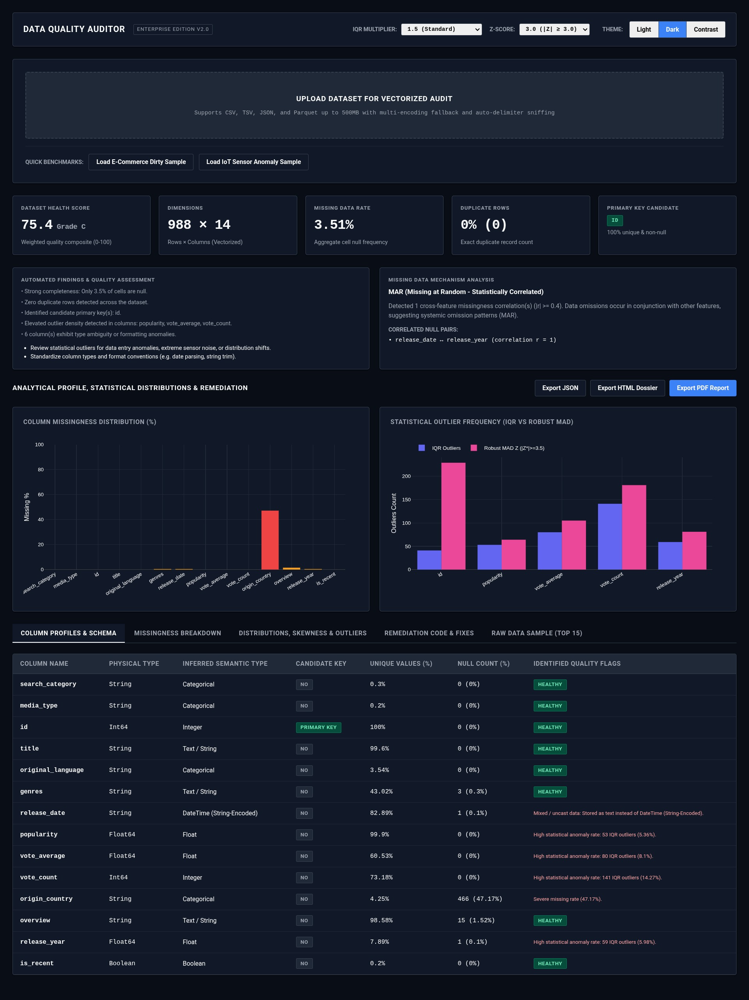

# Automated Data Quality Auditor

An enterprise-grade, full-stack Data Quality Auditor designed for high-throughput exploratory data analysis (EDA), statistical anomaly detection, missing data mechanism classification, and rule-based remediation generation. Engineered with a Python FastAPI asynchronous backend, multi-threaded Polars computation engine, and a strictly styled, theme-aware responsive web interface.



---

## 1. System Architecture & Overview

The system processes large and messy tabular datasets (up to 500MB) without memory bloat by utilizing zero-copy Apache Arrow memory buffers and multi-threaded Polars SIMD expressions, completely bypassing traditional Pandas bottleneck loops.

```
┌─────────────────────────────────────────────────────────────────────────────┐
│                             CLIENT PRESENTATION LAYER                       │
│  - Responsive Enterprise SPA (Served via FastAPI Static Engine)             │
│  - Strict Professional Theming: Light, Dark, High-Contrast System Modes     │
│  - Vectorized Plotly Analytics: Null distributions, Dual Outlier comparisons│
│  - Interactive Remediation Terminal: Copy-pasteable Polars & SQL transforms │
│  - One-Click Export Engine: Machine JSON, Standalone HTML, WeasyPrint PDF   │
└──────────────────────────────────────┬──────────────────────────────────────┘
                                       │ Multipart Stream
                                       ▼
┌─────────────────────────────────────────────────────────────────────────────┐
│                          ASYNCHRONOUS FASTAPI SERVICE                       │
│  - Non-blocking I/O with Pydantic v2 payload validation                     │
│  - Multi-Encoding Sniffer & Delimiter Detection (UTF-8, Latin-1, CP1252)    │
│  - Dynamic Anomaly Threshold Routing (Configurable IQR & Z-Score parameters)│
└──────────────────────────────────────┬──────────────────────────────────────┘
                                       │ Arrow Memory Buffer
                                       ▼
┌─────────────────────────────────────────────────────────────────────────────┐
│                         VECTORIZED POLARS AUDIT ENGINE                      │
│  - Automated Profiling: Dimensions, duplicate detection, primary key search │
│  - Semantic Type Inference: String-encoded numbers, dates, booleans         │
│  - Statistical Moments: Mean, Std Dev, Median, Skewness, Kurtosis           │
│  - Outlier Detection: Configurable IQR fences & Robust MAD Modified Z-Score │
│  - Missing Data Patterns: Correlation-driven MCAR vs. MAR classification    │
│  - Health Scoring: Multi-pillar weighted quality index (0 - 100)            │
│  - Remediation Planner: Rule-based imputation, casting & clipping generator │
└─────────────────────────────────────────────────────────────────────────────┘
```

---

## 2. Core Features & Analytical Engine

### Vectorized Ingestion & Format Sniffing
- Supports **CSV**, **TSV**, **JSON** (records, columnar, NDJSON), and **Parquet**.
- Automatic delimiter sniffing (`,`, `;`, `\t`, `|`).
- Multi-encoding resilience with automated fallback sequence (`UTF-8` &rarr; `Latin-1` &rarr; `ISO-8859-1` &rarr; `CP1252`) and ragged-line truncation recovery.

### Automated Exploratory Data Profiling
- **Dimensions & Cardinality**: Total rows, column counts, total cell quantification, unique value rates.
- **Candidate Primary Key Detection**: Identifies columns satisfying strict 100% uniqueness and 0% null criteria.
- **Duplicate Record Detection**: Exact multi-column row duplicate quantification.
- **Semantic Type Inference**: Detects string-encoded floats/integers, ISO-8601 date strings, and boolean flags masked as text.

### Advanced Statistical Distribution Modeling
- **Skewness & Kurtosis**: Evaluates Fisher-Pearson standardized third and fourth moments to categorize distribution shapes:
  - *Symmetric / Normal* ($|\text{Skew}| \le 0.5$)
  - *Moderately Skewed* ($0.5 < |\text{Skew}| \le 1.0$)
  - *Highly Skewed* ($|\text{Skew}| > 1.0$)
  - *Heavy-Tailed Leptokurtic* ($\text{Kurtosis} > 2.0$)
- **Dual Outlier Detection**:
  - **Interquartile Range (IQR)**: Lower fence $Q_1 - k \times IQR$, Upper fence $Q_3 + k \times IQR$ with user-configurable multiplier $k$ (default 1.5).
  - **Classical Z-Score**: Flagging records where $|Z| \ge \text{threshold}$ (default 3.0).
  - **Robust Modified Z-Score (MAD)**: Median Absolute Deviation metric resistant to extreme outlier masking:
    $$M_i = \frac{0.6745 \times |x_i - \tilde{x}|}{\text{MAD}}$$

### Missing Data Mechanism Analysis (MCAR vs. MAR)
- Generates a cross-feature null indicator correlation matrix ($r_{\phi}$).
- **MCAR (Missing Completely at Random)**: Nulls are independently distributed with negligible cross-feature correlation ($|r| < 0.4$).
- **MAR (Missing at Random - Correlated)**: Statistically significant co-occurrence identified between missing indicators ($|r| \ge 0.4$), alerting engineers to systemic data ingestion failures.

### Rule-Based Remediation Code Generator
- Synthesizes ready-to-run **Polars (Python)** and **ANSI SQL** transformation code directly from audit diagnostics:
  - Distribution-aware imputation (median imputation for skewed variables, mean for normal distributions, mode for categoricals).
  - Explicit type casts for corrupted string columns.
  - Record deduplication calls (`df.unique()`).
  - Statistical boundary clipping expressions.

---

## 3. Project Directory Structure

```
data-quality-auditor/
├── backend/
│   ├── __init__.py
│   ├── main.py                  # FastAPI application, CORS, routers & static mount
│   ├── models.py                # Strongly-typed Pydantic v2 schemas
│   ├── engine/
│   │   ├── __init__.py
│   │   ├── ingestion.py         # Multi-encoding sniffer, CSV/JSON/Parquet loader
│   │   ├── profiler.py          # Vectorized EDA & semantic type detection
│   │   ├── anomaly.py           # Skewness, Kurtosis, IQR, MAD Z-score, MCAR/MAR
│   │   ├── scorer.py            # Quality health scoring algorithm (0-100)
│   │   └── remediation.py       # Rule-based Polars & ANSI SQL code generator
│   └── export/
│       ├── __init__.py
│       └── reporter.py          # Standalone HTML, WeasyPrint PDF & JSON exporters
├── frontend/
│   ├── index.html               # Enterprise dashboard interface
│   ├── css/
│   │   └── styles.css           # Theme engine (Light, Dark, Contrast)
│   └── js/
│       └── app.js               # Reactive upload, threshold binding, Plotly charts
├── data/
│   └── samples/
│       ├── messy_ecommerce.csv  # E-commerce benchmark with nulls, duplicates & outliers
│       └── messy_sensors.csv    # IoT sensor benchmark with anomalous physical readings
├── tests/
│   ├── __init__.py
│   ├── test_engine.py           # Unit tests for statistical calculations & encoding
│   ├── test_api.py              # Integration tests for FastAPI endpoints
│   └── test_edge_cases.py       # Robustness tests for empty, single-col & 100% null sets
├── screenshots/
│   └── example.png              # Showcase preview of the auditor dashboard
├── Dockerfile                   # Multi-stage production container build
├── docker-compose.yml           # Production service orchestration
├── pyproject.toml               # Poetry package & pytest configuration
├── requirements.txt             # Pip dependency lockfile
└── README.md                    # Technical documentation
```

---

## 4. Getting Started & Local Execution

### Prerequisites
- Python 3.10 or higher (compatible up to Python 3.14)
- Git

### Installation via Standard Virtual Environment
```bash
# 1. Clone repository
git clone https://github.com/akmhabibulislam/data-quality-auditor.git
cd data-quality-auditor

# 2. Create and activate virtual environment
python3 -m venv .venv
source .venv/bin/activate

# 3. Install dependencies
pip install -r requirements.txt

# 4. Execute the automated test suite
pytest -v tests/

# 5. Launch development server
uvicorn backend.main:app --host 0.0.0.0 --port 8000 --reload
```

### Installation via Poetry
```bash
# 1. Install dependencies
poetry install

# 2. Execute test suite
poetry run pytest -v tests/

# 3. Launch application
poetry run uvicorn backend.main:app --host 0.0.0.0 --port 8000 --reload
```

Once running, navigate to `http://localhost:8000` in your web browser.

---

## 5. Containerized Deployment (Docker & Compose)

The repository provides a multi-stage `Dockerfile` with minimal Debian runtime dependencies and WeasyPrint rendering libraries (Pango, Cairo, HarfBuzz), orchestrated via `docker-compose.yml` with health checks.

### Running via Docker Compose
```bash
# Build image and start service in background
docker compose up -d --build

# View real-time container logs
docker compose logs -f

# Verify service health status
docker compose ps

# Stop container service
docker compose down
```

### Running Standalone Docker Container
```bash
# Build image
docker build -t data-quality-auditor:latest .

# Run container
docker run -d --name data-auditor -p 8000:8000 data-quality-auditor:latest
```

---

## 6. API Reference & Extensibility

Interactive Swagger documentation is available at `http://localhost:8000/docs`.

### Core Endpoints

| HTTP Method | Path | Description |
|---|---|---|
| `GET` | `/` | Serves the enterprise web application |
| `POST` | `/api/audit` | Accepts multipart file (`file`) with optional `iqr_multiplier` and `zscore_threshold` |
| `POST` | `/api/audit/sample/{name}` | Profiles bundled benchmark datasets (`messy_ecommerce`, `messy_sensors`) |
| `POST` | `/api/export/json` | Downloads the active audit report as a structured JSON object |
| `POST` | `/api/export/html` | Downloads a self-contained, standalone HTML audit dossier |
| `POST` | `/api/export/pdf` | Renders and downloads an executive-ready PDF report |

### Python Programmatic Usage
The core profiling engine can be imported and executed in data science notebooks or automated ETL pipelines:

```python
import polars as pl
from backend.engine.profiler import profile_dataset
from backend.models import AuditConfig

# Load dataset
df = pl.read_csv("data/samples/messy_ecommerce.csv")

# Run audit with custom configuration
config = AuditConfig(iqr_multiplier=1.5, zscore_threshold=3.0)
report = profile_dataset(df, filename="messy_ecommerce.csv", file_size_bytes=1024, file_format="CSV", config=config)

# Access diagnostic metrics
print(f"Health Score: {report.health_score.overall_score} (Grade {report.health_score.grade})")
print(f"Missing Mechanism: {report.missing_analysis.mechanism_hypothesis}")
print("Remediation Script (Polars):")
print(report.remediation.polars_code)
```
